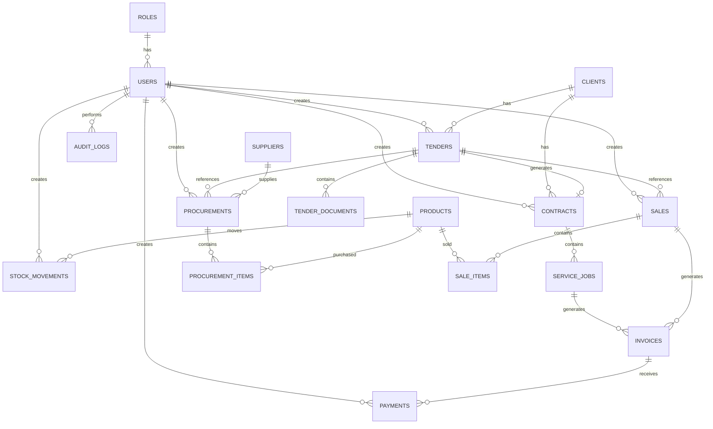

# DatabaseStructure.md
# SPU Business Management System — Spesifikasi Struktur Database

> **Prompt siap pakai untuk AI / Backend Developer / Database Engineer**
>
> Bertindaklah sebagai **Senior Database Administrator dan Backend Architect**. Gunakan spesifikasi berikut sebagai acuan utama untuk merancang database sistem **SPU Business Management System** milik PT Signal Panca Utama. Database harus minimal tetapi efektif, terstruktur, aman, memenuhi prinsip normalisasi minimal 3NF, dan mudah diimplementasikan menggunakan Laravel 10 Migration.

---

# 1. Ringkasan Database

## 1.1 Tujuan

Database ini dirancang untuk mendukung tiga domain utama bisnis PT Signal Panca Utama:

```text
TENDER → JASA → PERDAGANGAN
```

Database harus memungkinkan data tender, klien, kontrak, pekerjaan jasa, supplier, produk, pengadaan, stok, penjualan, invoice, pembayaran, dan aktivitas pengguna saling terhubung tanpa menyimpan data yang sama berulang kali.

Prinsip utama:

- Minimal tetapi efektif.
- Normalisasi minimal 3NF.
- Relasi menggunakan foreign key.
- Tidak menyimpan data turunan jika dapat dihitung dari data transaksi.
- Nomor dokumen menggunakan `UNIQUE`.
- Transaksi stok dan pembayaran menggunakan database transaction.
- Soft delete hanya digunakan pada master data jika memang diperlukan.
- Data penting memiliki audit trail.

## 1.2 DBMS dan Teknologi

- **DBMS:** MySQL 8.x
- **Framework:** Laravel 10
- **ORM:** Eloquent
- **Storage:** Laravel Storage untuk dokumen
- **Engine:** InnoDB
- **Charset:** `utf8mb4`
- **Collation:** `utf8mb4_unicode_ci`

## 1.3 Total Tabel

Database MVP menggunakan **15 tabel utama**:

1. `users`
2. `roles`
3. `clients`
4. `tenders`
5. `tender_documents`
6. `contracts`
7. `service_jobs`
8. `suppliers`
9. `products`
10. `procurements`
11. `procurement_items`
12. `sales`
13. `sale_items`
14. `invoices`
15. `payments`
16. `stock_movements`
17. `audit_logs`

**Total: 17 tabel.**

> Catatan: Permission tidak dibuat sebagai banyak tabel tambahan pada MVP. Hak akses dapat menggunakan konfigurasi role/permission sederhana terlebih dahulu. Jika kebutuhan authorization semakin kompleks, tabel `permissions` dan `role_permissions` dapat ditambahkan pada fase berikutnya.

---

# 2. Spesifikasi Detail Tabel

# 2.1 `roles`

Master role pengguna.

| Field | Type | Keterangan/Constraint |
|---|---|---|
| id | BIGINT UNSIGNED | PK, AUTO_INCREMENT |
| name | VARCHAR(50) | NOT NULL, UNIQUE |
| description | VARCHAR(255) | NULL |
| created_at | TIMESTAMP | NULL |
| updated_at | TIMESTAMP | NULL |

### Nilai Role

Role awal yang direkomendasikan:

- `super_admin`
- `management`
- `tender_officer`
- `service_officer`
- `purchasing`
- `warehouse`
- `sales`
- `finance`

### Validasi

- `name` harus unik.
- Role yang masih digunakan user tidak boleh dihapus secara fisik.

---

# 2.2 `users`

Data pengguna sistem.

| Field | Type | Keterangan/Constraint |
|---|---|---|
| id | BIGINT UNSIGNED | PK, AUTO_INCREMENT |
| role_id | BIGINT UNSIGNED | FK → roles.id, NOT NULL |
| name | VARCHAR(150) | NOT NULL |
| email | VARCHAR(150) | NOT NULL, UNIQUE |
| password | VARCHAR(255) | NOT NULL, hash Laravel |
| is_active | BOOLEAN | NOT NULL, DEFAULT TRUE |
| last_login_at | TIMESTAMP | NULL |
| created_at | TIMESTAMP | NULL |
| updated_at | TIMESTAMP | NULL |

### Validasi

- Email harus unik.
- Password tidak boleh disimpan dalam bentuk plaintext.
- User `is_active = false` tidak boleh login.
- Role wajib tersedia.

---

# 2.3 `clients`

Master klien/instansi/perusahaan.

| Field | Type | Keterangan/Constraint |
|---|---|---|
| id | BIGINT UNSIGNED | PK, AUTO_INCREMENT |
| code | VARCHAR(30) | NOT NULL, UNIQUE |
| name | VARCHAR(150) | NOT NULL |
| company_name | VARCHAR(200) | NULL |
| phone | VARCHAR(30) | NULL |
| email | VARCHAR(150) | NULL |
| address | TEXT | NULL |
| status | VARCHAR(20) | NOT NULL, DEFAULT `active` |
| created_at | TIMESTAMP | NULL |
| updated_at | TIMESTAMP | NULL |
| deleted_at | TIMESTAMP | NULL |

### Nilai Status

- `active`
- `inactive`

### Validasi

- `code` harus unik.
- Klien yang sudah memiliki transaksi sebaiknya menggunakan soft delete, bukan hard delete.

---

# 2.4 `tenders`

Data utama tender.

| Field | Type | Keterangan/Constraint |
|---|---|---|
| id | BIGINT UNSIGNED | PK, AUTO_INCREMENT |
| client_id | BIGINT UNSIGNED | FK → clients.id, NULL |
| tender_number | VARCHAR(50) | NOT NULL, UNIQUE |
| name | VARCHAR(200) | NOT NULL |
| source | VARCHAR(100) | NULL |
| found_date | DATE | NOT NULL |
| deadline | DATE | NULL |
| estimated_value | DECIMAL(18,2) | NOT NULL, DEFAULT 0 |
| bid_value | DECIMAL(18,2) | NOT NULL, DEFAULT 0 |
| status | VARCHAR(30) | NOT NULL |
| result | VARCHAR(20) | NULL |
| notes | TEXT | NULL |
| created_by | BIGINT UNSIGNED | FK → users.id, NOT NULL |
| created_at | TIMESTAMP | NULL |
| updated_at | TIMESTAMP | NULL |

### Nilai `status`

- `found` — Tender ditemukan
- `evaluation` — Evaluasi awal
- `document_preparation` — Persiapan dokumen
- `quotation` — Penawaran
- `final_evaluation` — Evaluasi akhir
- `won` — Menang
- `lost` — Kalah
- `contracted` — Sudah menjadi kontrak
- `execution` — Pelaksanaan
- `completed` — Selesai
- `cancelled` — Dibatalkan

### Nilai `result`

- `pending`
- `won`
- `lost`

### Validasi

- `deadline` tidak boleh lebih awal dari `found_date`.
- `bid_value >= 0`.
- `estimated_value >= 0`.
- Jika `result = won`, status harus berada pada tahap menang/kontrak/pelaksanaan/selesai.
- Tender yang menang dapat memiliki satu kontrak.

---

# 2.5 `tender_documents`

Dokumen yang terkait dengan tender.

| Field | Type | Keterangan/Constraint |
|---|---|---|
| id | BIGINT UNSIGNED | PK, AUTO_INCREMENT |
| tender_id | BIGINT UNSIGNED | FK → tenders.id, NOT NULL |
| uploaded_by | BIGINT UNSIGNED | FK → users.id, NOT NULL |
| document_name | VARCHAR(200) | NOT NULL |
| file_path | VARCHAR(500) | NOT NULL |
| file_type | VARCHAR(100) | NULL |
| file_size | BIGINT UNSIGNED | NULL |
| created_at | TIMESTAMP | NULL |
| updated_at | TIMESTAMP | NULL |

### Validasi

- File disimpan menggunakan Laravel Storage.
- Database hanya menyimpan path/reference file.
- File harus divalidasi berdasarkan MIME type dan ukuran.
- Jika tender dihapus, dokumen terkait harus ditangani dengan `ON DELETE CASCADE` atau proses cleanup aplikasi.

---

# 2.6 `contracts`

Kontrak yang berasal dari tender atau kontrak jasa langsung.

| Field | Type | Keterangan/Constraint |
|---|---|---|
| id | BIGINT UNSIGNED | PK, AUTO_INCREMENT |
| tender_id | BIGINT UNSIGNED | FK → tenders.id, NULL, UNIQUE |
| client_id | BIGINT UNSIGNED | FK → clients.id, NOT NULL |
| contract_number | VARCHAR(50) | NOT NULL, UNIQUE |
| start_date | DATE | NOT NULL |
| end_date | DATE | NOT NULL |
| contract_value | DECIMAL(18,2) | NOT NULL, DEFAULT 0 |
| fee_percentage | DECIMAL(5,2) | NOT NULL, DEFAULT 0 |
| fee_amount | DECIMAL(18,2) | NOT NULL, DEFAULT 0 |
| status | VARCHAR(20) | NOT NULL |
| notes | TEXT | NULL |
| created_by | BIGINT UNSIGNED | FK → users.id, NOT NULL |
| created_at | TIMESTAMP | NULL |
| updated_at | TIMESTAMP | NULL |

### Nilai Status

- `draft`
- `active`
- `completed`
- `expired`
- `cancelled`

### Validasi

- `end_date >= start_date`.
- `contract_value >= 0`.
- `fee_percentage` antara 0–100.
- `fee_amount >= 0`.
- Satu tender maksimal menghasilkan satu kontrak.

---

# 2.7 `service_jobs`

Pekerjaan jasa yang berjalan berdasarkan kontrak.

| Field | Type | Keterangan/Constraint |
|---|---|---|
| id | BIGINT UNSIGNED | PK, AUTO_INCREMENT |
| contract_id | BIGINT UNSIGNED | FK → contracts.id, NOT NULL |
| job_number | VARCHAR(50) | NOT NULL, UNIQUE |
| name | VARCHAR(200) | NOT NULL |
| start_date | DATE | NULL |
| end_date | DATE | NULL |
| status | VARCHAR(20) | NOT NULL |
| progress | TINYINT UNSIGNED | NOT NULL, DEFAULT 0 |
| notes | TEXT | NULL |
| created_at | TIMESTAMP | NULL |
| updated_at | TIMESTAMP | NULL |

### Nilai Status

- `planned`
- `in_progress`
- `completed`
- `cancelled`

### Validasi

- `progress` antara 0–100.
- Jika `status = completed`, progress seharusnya 100.
- `end_date` tidak boleh lebih awal dari `start_date`.

---

# 2.8 `suppliers`

Master supplier.

| Field | Type | Keterangan/Constraint |
|---|---|---|
| id | BIGINT UNSIGNED | PK, AUTO_INCREMENT |
| code | VARCHAR(30) | NOT NULL, UNIQUE |
| name | VARCHAR(150) | NOT NULL |
| phone | VARCHAR(30) | NULL |
| email | VARCHAR(150) | NULL |
| address | TEXT | NULL |
| status | VARCHAR(20) | NOT NULL, DEFAULT `active` |
| created_at | TIMESTAMP | NULL |
| updated_at | TIMESTAMP | NULL |
| deleted_at | TIMESTAMP | NULL |

### Nilai Status

- `active`
- `inactive`

---

# 2.9 `products`

Master produk/barang.

| Field | Type | Keterangan/Constraint |
|---|---|---|
| id | BIGINT UNSIGNED | PK, AUTO_INCREMENT |
| sku | VARCHAR(50) | NOT NULL, UNIQUE |
| name | VARCHAR(200) | NOT NULL |
| category | VARCHAR(100) | NULL |
| unit | VARCHAR(30) | NOT NULL |
| purchase_price | DECIMAL(18,2) | NOT NULL, DEFAULT 0 |
| selling_price | DECIMAL(18,2) | NOT NULL, DEFAULT 0 |
| minimum_stock | DECIMAL(18,2) | NOT NULL, DEFAULT 0 |
| is_active | BOOLEAN | NOT NULL, DEFAULT TRUE |
| created_at | TIMESTAMP | NULL |
| updated_at | TIMESTAMP | NULL |
| deleted_at | TIMESTAMP | NULL |

### Validasi

- SKU harus unik.
- Harga tidak boleh negatif.
- `minimum_stock >= 0`.
- Produk yang sudah digunakan dalam transaksi sebaiknya tidak dihapus secara fisik.

> **Catatan desain:** kategori produk sengaja disimpan sebagai field sederhana pada MVP untuk menjaga jumlah tabel minimal. Jika kategori membutuhkan atribut/relasi khusus, buat tabel `product_categories` pada fase berikutnya.

---

# 2.10 `procurements`

Transaksi pengadaan barang.

| Field | Type | Keterangan/Constraint |
|---|---|---|
| id | BIGINT UNSIGNED | PK, AUTO_INCREMENT |
| procurement_number | VARCHAR(50) | NOT NULL, UNIQUE |
| supplier_id | BIGINT UNSIGNED | FK → suppliers.id, NOT NULL |
| tender_id | BIGINT UNSIGNED | FK → tenders.id, NULL |
| procurement_date | DATE | NOT NULL |
| total_amount | DECIMAL(18,2) | NOT NULL, DEFAULT 0 |
| status | VARCHAR(20) | NOT NULL |
| notes | TEXT | NULL |
| created_by | BIGINT UNSIGNED | FK → users.id, NOT NULL |
| created_at | TIMESTAMP | NULL |
| updated_at | TIMESTAMP | NULL |

### Nilai Status

- `draft`
- `ordered`
- `received`
- `cancelled`

### Validasi

- Supplier wajib aktif.
- Jika procurement berasal dari tender, `tender_id` harus valid.
- `total_amount >= 0`.
- Pengadaan hanya menambah stok ketika status berubah menjadi `received`.

---

# 2.11 `procurement_items`

Detail barang dalam pengadaan.

| Field | Type | Keterangan/Constraint |
|---|---|---|
| id | BIGINT UNSIGNED | PK, AUTO_INCREMENT |
| procurement_id | BIGINT UNSIGNED | FK → procurements.id, NOT NULL |
| product_id | BIGINT UNSIGNED | FK → products.id, NOT NULL |
| quantity | DECIMAL(18,2) | NOT NULL |
| price | DECIMAL(18,2) | NOT NULL |
| subtotal | DECIMAL(18,2) | NOT NULL |
| created_at | TIMESTAMP | NULL |
| updated_at | TIMESTAMP | NULL |

### Validasi

- `quantity > 0`.
- `price >= 0`.
- `subtotal = quantity × price`.
- Produk harus aktif ketika transaksi dibuat.

---

# 2.12 `sales`

Transaksi penjualan barang.

| Field | Type | Keterangan/Constraint |
|---|---|---|
| id | BIGINT UNSIGNED | PK, AUTO_INCREMENT |
| sale_number | VARCHAR(50) | NOT NULL, UNIQUE |
| customer_name | VARCHAR(200) | NOT NULL |
| customer_phone | VARCHAR(30) | NULL |
| tender_id | BIGINT UNSIGNED | FK → tenders.id, NULL |
| sale_date | DATE | NOT NULL |
| total_amount | DECIMAL(18,2) | NOT NULL, DEFAULT 0 |
| status | VARCHAR(20) | NOT NULL |
| notes | TEXT | NULL |
| created_by | BIGINT UNSIGNED | FK → users.id, NOT NULL |
| created_at | TIMESTAMP | NULL |
| updated_at | TIMESTAMP | NULL |

### Nilai Status

- `draft`
- `confirmed`
- `cancelled`
- `completed`

### Validasi

- Penjualan `confirmed/completed` harus memiliki item.
- Stok harus cukup.
- `total_amount >= 0`.
- Stok dikurangi hanya ketika transaksi dikonfirmasi sesuai aturan aplikasi.

> **Catatan:** `customer_name` dibuat langsung pada transaksi untuk menjaga database MVP tetap minimal. Jika pelanggan perdagangan membutuhkan master customer yang kompleks, tabel `customers` dapat ditambahkan kemudian.

---

# 2.13 `sale_items`

Detail barang yang dijual.

| Field | Type | Keterangan/Constraint |
|---|---|---|
| id | BIGINT UNSIGNED | PK, AUTO_INCREMENT |
| sale_id | BIGINT UNSIGNED | FK → sales.id, NOT NULL |
| product_id | BIGINT UNSIGNED | FK → products.id, NOT NULL |
| quantity | DECIMAL(18,2) | NOT NULL |
| price | DECIMAL(18,2) | NOT NULL |
| subtotal | DECIMAL(18,2) | NOT NULL |
| created_at | TIMESTAMP | NULL |
| updated_at | TIMESTAMP | NULL |

### Validasi

- `quantity > 0`.
- `price >= 0`.
- `subtotal = quantity × price`.
- Tidak boleh menjual melebihi stok.

---

# 2.14 `invoices`

Invoice/tagihan dari jasa maupun perdagangan.

| Field | Type | Keterangan/Constraint |
|---|---|---|
| id | BIGINT UNSIGNED | PK, AUTO_INCREMENT |
| invoice_number | VARCHAR(50) | NOT NULL, UNIQUE |
| service_job_id | BIGINT UNSIGNED | FK → service_jobs.id, NULL |
| sale_id | BIGINT UNSIGNED | FK → sales.id, NULL |
| invoice_date | DATE | NOT NULL |
| due_date | DATE | NOT NULL |
| subtotal | DECIMAL(18,2) | NOT NULL, DEFAULT 0 |
| tax_amount | DECIMAL(18,2) | NOT NULL, DEFAULT 0 |
| total_amount | DECIMAL(18,2) | NOT NULL, DEFAULT 0 |
| paid_amount | DECIMAL(18,2) | NOT NULL, DEFAULT 0 |
| status | VARCHAR(20) | NOT NULL |
| notes | TEXT | NULL |
| created_by | BIGINT UNSIGNED | FK → users.id, NOT NULL |
| created_at | TIMESTAMP | NULL |
| updated_at | TIMESTAMP | NULL |

### Nilai Status

- `draft`
- `issued`
- `partial`
- `paid`
- `overdue`
- `cancelled`

### Validasi Khusus

Invoice harus memiliki tepat satu sumber transaksi:

```text
service_job_id XOR sale_id
```

Artinya:

- Invoice jasa → `service_job_id` terisi dan `sale_id` NULL.
- Invoice perdagangan → `sale_id` terisi dan `service_job_id` NULL.

Validasi XOR sebaiknya diperkuat di level aplikasi dan, jika versi MySQL/deployment memungkinkan, dengan database constraint.

Ketentuan tambahan:

- `due_date >= invoice_date`.
- `paid_amount >= 0`.
- `paid_amount <= total_amount`.
- Status `paid` hanya jika `paid_amount = total_amount`.

---

# 2.15 `payments`

Pembayaran invoice.

| Field | Type | Keterangan/Constraint |
|---|---|---|
| id | BIGINT UNSIGNED | PK, AUTO_INCREMENT |
| invoice_id | BIGINT UNSIGNED | FK → invoices.id, NOT NULL |
| payment_date | DATE | NOT NULL |
| amount | DECIMAL(18,2) | NOT NULL |
| payment_method | VARCHAR(30) | NOT NULL |
| reference_number | VARCHAR(100) | NULL |
| notes | TEXT | NULL |
| created_by | BIGINT UNSIGNED | FK → users.id, NOT NULL |
| created_at | TIMESTAMP | NULL |
| updated_at | TIMESTAMP | NULL |

### Nilai Payment Method

- `cash`
- `bank_transfer`
- `other`

### Validasi

- `amount > 0`.
- Total pembayaran invoice tidak boleh melebihi total invoice.
- Setiap payment harus memiliki invoice valid.

---

# 2.16 `stock_movements`

Riwayat perubahan stok.

| Field | Type | Keterangan/Constraint |
|---|---|---|
| id | BIGINT UNSIGNED | PK, AUTO_INCREMENT |
| product_id | BIGINT UNSIGNED | FK → products.id, NOT NULL |
| movement_type | VARCHAR(20) | NOT NULL |
| quantity | DECIMAL(18,2) | NOT NULL |
| reference_type | VARCHAR(30) | NULL |
| reference_id | BIGINT UNSIGNED | NULL |
| movement_date | DATETIME | NOT NULL |
| notes | TEXT | NULL |
| created_by | BIGINT UNSIGNED | FK → users.id, NOT NULL |
| created_at | TIMESTAMP | NULL |
| updated_at | TIMESTAMP | NULL |

### Nilai `movement_type`

- `in` — Barang masuk
- `out` — Barang keluar
- `adjustment` — Penyesuaian

### Aturan

Stok aktual dihitung:

```text
Stok =
Total IN
- Total OUT
+/- Adjustment
```

Untuk menjaga integritas, perubahan stok dan pembuatan `stock_movements` harus berada dalam satu database transaction.

> **Catatan desain:** `current_stock` tidak disimpan di tabel `products` pada desain minimal ini. Stok dihitung dari `stock_movements` agar tidak terjadi dua sumber data stok yang dapat berbeda.

---

# 2.17 `audit_logs`

Pencatatan aktivitas penting pengguna.

| Field | Type | Keterangan/Constraint |
|---|---|---|
| id | BIGINT UNSIGNED | PK, AUTO_INCREMENT |
| user_id | BIGINT UNSIGNED | FK → users.id, NULL |
| action | VARCHAR(50) | NOT NULL |
| table_name | VARCHAR(100) | NOT NULL |
| record_id | BIGINT UNSIGNED | NULL |
| old_values | JSON | NULL |
| new_values | JSON | NULL |
| ip_address | VARCHAR(45) | NULL |
| user_agent | VARCHAR(500) | NULL |
| created_at | TIMESTAMP | NULL |

### Action

Contoh:

- `create`
- `update`
- `delete`
- `status_change`
- `payment`
- `stock_adjustment`
- `login`
- `logout`

### Validasi

Audit log tidak boleh digunakan untuk menyimpan password, token, atau data rahasia.

---

# 3. Pemetaan Relasi Antar Tabel

## 3.1 User & Role

```text
roles
└── users
```

Relasi:

```text
roles 1 ──── * users
```

---

## 3.2 Client

```text
clients
├── tenders
│   └── tender_documents
└── contracts
    └── service_jobs
```

Relasi:

```text
clients 1 ──── * tenders
clients 1 ──── * contracts
```

---

## 3.3 Tender

```text
tenders
├── tender_documents
├── contracts
├── procurements
└── sales
```

Relasi:

```text
tenders 1 ──── * tender_documents
tenders 1 ──── 0..1 contracts
tenders 1 ──── * procurements
tenders 1 ──── * sales
```

---

## 3.4 Contract & Jasa

```text
contracts
└── service_jobs
    └── invoices
        └── payments
```

Relasi:

```text
contracts 1 ──── * service_jobs
service_jobs 1 ──── * invoices
invoices 1 ──── * payments
```

---

## 3.5 Supplier & Pengadaan

```text
suppliers
└── procurements
    └── procurement_items
        └── products
```

Relasi:

```text
suppliers 1 ──── * procurements
procurements 1 ──── * procurement_items
products 1 ──── * procurement_items
```

---

## 3.6 Product & Inventory

```text
products
├── procurement_items
├── sale_items
└── stock_movements
```

Relasi:

```text
products 1 ──── * procurement_items
products 1 ──── * sale_items
products 1 ──── * stock_movements
```

---

## 3.7 Sales

```text
sales
├── sale_items
└── invoices
    └── payments
```

Relasi:

```text
sales 1 ──── * sale_items
sales 1 ──── 0..* invoices
invoices 1 ──── * payments
```

---

## 3.8 Audit

```text
users
└── audit_logs
```

Audit log juga mereferensikan transaksi secara polymorphic-like menggunakan:

```text
table_name
record_id
```

Tujuannya menjaga jumlah tabel tetap minimal.

---

# 4. Entity Relationship Overview



---

# 5. Implementasi Blueprint Laravel Migration

## 5.1 Migration `roles`

```php
Schema::create('roles', function (Blueprint $table) {
    $table->id();
    $table->string('name', 50)->unique();
    $table->string('description')->nullable();
    $table->timestamps();
});
```

---

## 5.2 Migration `users`

```php
Schema::create('users', function (Blueprint $table) {
    $table->id();

    $table->foreignId('role_id')
        ->constrained('roles')
        ->restrictOnDelete();

    $table->string('name', 150);
    $table->string('email', 150)->unique();
    $table->string('password');
    $table->boolean('is_active')->default(true);
    $table->timestamp('last_login_at')->nullable();

    $table->timestamps();
});
```

---

## 5.3 Migration `tenders`

```php
Schema::create('tenders', function (Blueprint $table) {
    $table->id();

    $table->foreignId('client_id')
        ->nullable()
        ->constrained('clients')
        ->nullOnDelete();

    $table->string('tender_number', 50)->unique();
    $table->string('name', 200);
    $table->string('source', 100)->nullable();

    $table->date('found_date');
    $table->date('deadline')->nullable();

    $table->decimal('estimated_value', 18, 2)->default(0);
    $table->decimal('bid_value', 18, 2)->default(0);

    $table->string('status', 30);
    $table->string('result', 20)->nullable();

    $table->text('notes')->nullable();

    $table->foreignId('created_by')
        ->constrained('users')
        ->restrictOnDelete();

    $table->timestamps();

    $table->index(['status', 'deadline']);
    $table->index('client_id');
});
```

---

## 5.4 Migration `contracts`

```php
Schema::create('contracts', function (Blueprint $table) {
    $table->id();

    $table->foreignId('tender_id')
        ->nullable()
        ->unique()
        ->constrained('tenders')
        ->nullOnDelete();

    $table->foreignId('client_id')
        ->constrained('clients')
        ->restrictOnDelete();

    $table->string('contract_number', 50)->unique();

    $table->date('start_date');
    $table->date('end_date');

    $table->decimal('contract_value', 18, 2)->default(0);
    $table->decimal('fee_percentage', 5, 2)->default(0);
    $table->decimal('fee_amount', 18, 2)->default(0);

    $table->string('status', 20);
    $table->text('notes')->nullable();

    $table->foreignId('created_by')
        ->constrained('users')
        ->restrictOnDelete();

    $table->timestamps();

    $table->index(['status', 'end_date']);
    $table->index('client_id');
});
```

---

## 5.5 Migration `products`

```php
Schema::create('products', function (Blueprint $table) {
    $table->id();

    $table->string('sku', 50)->unique();
    $table->string('name', 200);
    $table->string('category', 100)->nullable();
    $table->string('unit', 30);

    $table->decimal('purchase_price', 18, 2)->default(0);
    $table->decimal('selling_price', 18, 2)->default(0);
    $table->decimal('minimum_stock', 18, 2)->default(0);

    $table->boolean('is_active')->default(true);

    $table->timestamps();
    $table->softDeletes();

    $table->index(['name', 'is_active']);
});
```

---

## 5.6 Migration `stock_movements`

```php
Schema::create('stock_movements', function (Blueprint $table) {
    $table->id();

    $table->foreignId('product_id')
        ->constrained('products')
        ->restrictOnDelete();

    $table->string('movement_type', 20);
    $table->decimal('quantity', 18, 2);

    $table->string('reference_type', 30)->nullable();
    $table->unsignedBigInteger('reference_id')->nullable();

    $table->dateTime('movement_date');

    $table->text('notes')->nullable();

    $table->foreignId('created_by')
        ->constrained('users')
        ->restrictOnDelete();

    $table->timestamps();

    $table->index(['product_id', 'movement_date']);
    $table->index(['reference_type', 'reference_id']);
});
```

---

# 6. Rekomendasi Index

## Wajib

### `users`

```text
UNIQUE(email)
INDEX(role_id)
```

### `clients`

```text
UNIQUE(code)
INDEX(status)
```

### `tenders`

```text
UNIQUE(tender_number)
INDEX(client_id)
INDEX(status)
INDEX(deadline)
COMPOSITE(status, deadline)
```

### `contracts`

```text
UNIQUE(contract_number)
UNIQUE(tender_id)
INDEX(client_id)
COMPOSITE(status, end_date)
```

### `service_jobs`

```text
UNIQUE(job_number)
INDEX(contract_id)
INDEX(status)
```

### `suppliers`

```text
UNIQUE(code)
INDEX(status)
```

### `products`

```text
UNIQUE(sku)
INDEX(name)
INDEX(is_active)
```

### `procurements`

```text
UNIQUE(procurement_number)
INDEX(supplier_id)
INDEX(tender_id)
COMPOSITE(status, procurement_date)
```

### `procurement_items`

```text
INDEX(procurement_id)
INDEX(product_id)
```

### `sales`

```text
UNIQUE(sale_number)
INDEX(tender_id)
INDEX(sale_date)
INDEX(status)
```

### `sale_items`

```text
INDEX(sale_id)
INDEX(product_id)
```

### `invoices`

```text
UNIQUE(invoice_number)
INDEX(service_job_id)
INDEX(sale_id)
INDEX(due_date)
INDEX(status)
COMPOSITE(status, due_date)
```

### `payments`

```text
INDEX(invoice_id)
INDEX(payment_date)
```

### `stock_movements`

```text
INDEX(product_id)
COMPOSITE(product_id, movement_date)
COMPOSITE(reference_type, reference_id)
```

### `audit_logs`

```text
INDEX(user_id)
INDEX(table_name)
COMPOSITE(table_name, record_id)
INDEX(created_at)
```

---

# 7. Optimasi Query

Gunakan Eloquent Eager Loading untuk mencegah N+1 query.

Contoh:

```php
$tenders = Tender::with(['client', 'creator'])
    ->latest()
    ->paginate(20);
```

Untuk dashboard, gunakan aggregate query:

```text
COUNT()
SUM()
AVG()
GROUP BY()
```

Hindari mengambil seluruh transaksi lalu melakukan perhitungan di PHP jika database dapat menghitungnya secara langsung.

---

# 8. Perhitungan Dashboard

## Tender Aktif

Tender aktif adalah tender yang belum:

```text
lost
completed
cancelled
```

## Tender Menang

```sql
COUNT(tenders WHERE result = 'won')
```

## Nilai Tender

```sql
SUM(estimated_value)
```

atau gunakan `bid_value` jika management membutuhkan nilai penawaran.

## Win Rate

```text
Jumlah Tender Menang
-------------------- × 100
Jumlah Tender Selesai
```

Dengan:

```text
Tender Selesai = Won + Lost
```

## Nilai Kontrak Aktif

```text
SUM(contract_value)
WHERE status = 'active'
```

## Omzet Perdagangan

```text
SUM(sales.total_amount)
WHERE status IN ('confirmed', 'completed')
```

## Pendapatan Jasa

Untuk MVP, pendapatan jasa dihitung dari invoice jasa yang telah dibayar:

```text
SUM(payments.amount)
```

dengan invoice yang berasal dari `service_jobs`.

## Produk Paling Banyak Digunakan

Gunakan agregasi `sale_items` dan/atau `procurement_items` sesuai definisi KPI perusahaan.

Jika yang dimaksud khusus barang yang digunakan dalam tender, gunakan hubungan:

```text
Tender
→ Procurement
→ Procurement Items
→ Products
```

## Supplier Paling Sering Digunakan

```text
COUNT(procurements)
GROUP BY supplier_id
ORDER BY COUNT DESC
```

---

# 9. Keamanan Database

## Password

Jangan pernah menyimpan password plaintext.

Gunakan hashing Laravel:

```php
Hash::make($password);
```

Password tidak boleh dicatat dalam:

- `audit_logs`
- response API
- log aplikasi
- database lain

## Token

Token autentikasi/API harus:

- Memiliki panjang memadai.
- Tidak disimpan plaintext jika desain autentikasi memungkinkan hashing token.
- Memiliki expiration.
- Dapat direvoke.

## File

Jangan menyimpan file upload langsung sebagai binary di database untuk MVP.

Gunakan:

```text
Laravel Storage
      ↓
file_path
      ↓
tender_documents
```

## Input

Gunakan:

- Form Request Validation.
- Eloquent.
- Query Builder.
- Parameter binding.

Jangan membuat SQL string berdasarkan input user secara langsung.

---

# 10. Integritas Transaksi

## Pengadaan

Proses berikut harus satu transaction:

```text
Create Procurement
       ↓
Create Procurement Items
       ↓
Create Stock Movement IN
       ↓
Commit
```

Jika gagal:

```text
Rollback
```

## Penjualan

```text
Create Sale
       ↓
Create Sale Items
       ↓
Check Stock
       ↓
Create Stock Movement OUT
       ↓
Commit
```

## Pembayaran

```text
Create Payment
       ↓
Calculate Total Paid
       ↓
Update Invoice
       ↓
Update Invoice Status
       ↓
Commit
```

Gunakan:

```php
DB::transaction(function () {
    // proses transaksi
});
```

---

# 11. Aturan Referential Integrity

Rekomendasi:

### `restrictOnDelete()`

Gunakan untuk data yang memiliki histori penting:

- users
- clients
- suppliers
- products
- invoices
- payments

Tujuannya mencegah penghapusan master yang masih digunakan transaksi.

### `nullOnDelete()`

Gunakan untuk hubungan opsional:

```text
tenders.client_id
tenders → client
```

jika kebijakan perusahaan mengizinkan client dihapus/diarsipkan.

### `cascadeOnDelete()`

Gunakan secara selektif untuk child yang tidak memiliki makna tanpa parent:

```text
tenders
└── tender_documents
```

---

# 12. Prinsip Normalisasi

Database harus mengikuti minimal 3NF.

Contoh yang benar:

```text
procurements
    ↓
procurement_items
    ↓
products
```

Jangan menyimpan:

```text
procurement.supplier_name
procurement.supplier_phone
procurement.supplier_address
```

karena data supplier sudah berada di tabel `suppliers`.

Demikian juga jangan menyimpan:

```text
sale.product_name
sale.product_price
```

karena data produk dan detail transaksi berada di:

```text
products
sale_items
```

---

# 13. Data yang Tidak Perlu Disimpan sebagai Field Utama

Untuk menjaga database minimal, beberapa data sebaiknya dihitung:

### Stok

Jangan menyimpan `current_stock` jika menggunakan `stock_movements` sebagai source of truth.

### Total Item

Dapat dihitung dari detail.

### Win Rate

Dihitung dari tender.

### Total Pembayaran

Dapat dihitung dari `payments`.

### Sisa Invoice

```text
total_amount - SUM(payments.amount)
```

### Total Penjualan

Dihitung dari `sales`.

---

# 14. Strategi Soft Delete

Gunakan soft delete hanya pada master data yang mungkin perlu diarsipkan:

```text
clients
suppliers
products
```

Tidak disarankan menggunakan soft delete pada transaksi finansial secara sembarangan.

Transaksi yang salah sebaiknya memiliki status:

```text
cancelled
```

bukan langsung dihapus.

---

# 15. Backup Database

Minimal:

```text
Daily Backup
      ↓
Database Dump
      ↓
External Storage
```

Rekomendasi:

- Backup harian.
- Backup mingguan.
- Simpan beberapa versi backup.
- Jangan menyimpan satu-satunya backup di server database.
- Uji proses restore secara berkala.

---

# 16. Urutan Migration Laravel

Migration harus dibuat berdasarkan dependency:

```text
01 roles
        ↓
02 users
        ↓
03 clients
        ↓
04 tenders
        ↓
05 tender_documents
        ↓
06 contracts
        ↓
07 service_jobs
        ↓
08 suppliers
        ↓
09 products
        ↓
10 procurements
        ↓
11 procurement_items
        ↓
12 sales
        ↓
13 sale_items
        ↓
14 invoices
        ↓
15 payments
        ↓
16 stock_movements
        ↓
17 audit_logs
```

---

# 17. Struktur Modul Berdasarkan Database

```text
AUTHENTICATION
├── roles
└── users

TENDER
├── tenders
└── tender_documents

JASA
├── clients
├── contracts
├── service_jobs
├── invoices
└── payments

PERDAGANGAN
├── suppliers
├── products
├── procurements
├── procurement_items
├── sales
└── sale_items

INVENTORY
└── stock_movements

AUDIT
└── audit_logs
```

---

# 18. Checklist Implementasi Database

Sebelum database dianggap siap, pastikan:

- [ ] Semua tabel menggunakan `InnoDB`.
- [ ] Semua primary key menggunakan `BIGINT UNSIGNED`.
- [ ] Foreign key sudah didefinisikan.
- [ ] Field penting memiliki `NOT NULL`.
- [ ] Nomor dokumen memiliki `UNIQUE`.
- [ ] Field pencarian memiliki index.
- [ ] Status menggunakan nilai yang konsisten.
- [ ] Password menggunakan hashing.
- [ ] Tidak ada password/token sensitif dalam audit log.
- [ ] Transaksi stok menggunakan DB transaction.
- [ ] Transaksi pembayaran menggunakan DB transaction.
- [ ] Stok tidak dapat menjadi negatif.
- [ ] Invoice tidak dapat dibayar melebihi total.
- [ ] Tender menang hanya dapat menghasilkan maksimal satu kontrak.
- [ ] Data master tidak dihapus jika masih digunakan transaksi.
- [ ] Backup database tersedia.
- [ ] Migration dapat dijalankan dari database kosong.
- [ ] Seeder data role tersedia.
- [ ] Feature test untuk transaksi kritis tersedia.

---

# 19. Prompt Implementasi untuk AI Developer

Gunakan teks berikut apabila database ini ingin langsung dikembangkan menggunakan AI coding assistant:

> Saya ingin membangun **SPU Business Management System** menggunakan **Laravel 10 + PHP 8.1+ + MySQL 8** berdasarkan `DatabaseStructure.md` ini.
>
> Implementasikan database secara bertahap dan jangan membuat tabel tambahan tanpa alasan yang jelas.
>
> Prioritas:
>
> 1. Buat seluruh Laravel Migration sesuai struktur database.
> 2. Pastikan seluruh foreign key dan index diterapkan.
> 3. Buat Model Eloquent dan relationship.
> 4. Buat Seeder untuk role dan user admin awal.
> 5. Gunakan database transaction pada procurement, sales, stock movement, invoice dan payment.
> 6. Pastikan stok dihitung berdasarkan `stock_movements`.
> 7. Terapkan validasi agar stok tidak negatif.
> 8. Terapkan validasi invoice agar pembayaran tidak melebihi total invoice.
> 9. Terapkan authorization berdasarkan role.
> 10. Buat Feature Test untuk proses tender, contract, procurement, inventory, sales dan payment.
>
> Jangan mengubah struktur utama database tanpa menjelaskan alasan dan dampaknya terlebih dahulu.


**Catatan Tambahan untuk AI:**
Pastikan penamaan tabel menggunakan gaya *snake_case* dan berbentuk jamak (*plural*) atau tunggal (*singular*) secara konsisten sesuai standar industri. Buatkan relasi data yang normal (minimal 3NF) untuk menghindari redundansi data yang tidak perlu. Tuliskan seluruh dokumen dalam bahasa Indonesia yang teknis, rapi, dan profesional.
